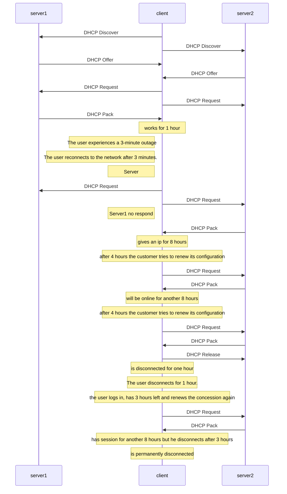

# DHCP_SCHEMA

```mermaid
sequenceDiagram
    
 Participant server1
 participant client
 participant server2
%% hen the client connects, it sends a broadcast request to the network.
 client->> server1: DHCP Discover
 client ->> server2: DHCP Discover
%% The servers to which the request has arrived respond to the client with their proposals.
 server1->> client: DHCP Offer
 server2->> client: DHCP Offer
 %% l cliente acepta una de ellas y le comunica la decisión al servidor elegido.

 client->> server1: DHCP Request
 client->> server2: DHCP Request
 server1->> client: DHCP Pack
 %% he server gives you the configuration information, including the time of granting
 note over client: works for 1 hour
 note left of client: The user experiences a 3-minute outage
 note left of client: The user reconnects to the network after 3 minutes.
 note left of client: Server #1 is down. 
 %%as the concession time had not expired, you can reconnect with the same configuration as before.
 client->> server1: DHCP Request
 client->> server2: DHCP Request
 note left of client: Server1 no respond
 server2->> client: DHCP Pack
 note over client: gives an ip for 8 hours
 %% after a certain percentage of the concession time, customers will try to renew their configuration.
 note over client: after 4 hours the customer tries to renew its configuration
 client ->> server2: DHCP Request
 server2 ->> client: DHCP Pack
%%  If the network interface is restarted, the client will attempt to have the server reassign the same %%configuration it had.
%%configuration it had. The process is similar to the assignment, but faster.
 note over client:will be online for another 8 hours
 note over client:after 4 hours the customer tries to renew its configuration
 client ->> server2:DHCP Request
 server2 ->>client: DHCP Pack
 client ->> server2: DHCP Release
 note over client: is disconnected for one hour
 note over client: The user disconnects for 1 hour. 
 note over client: the user logs in, has 3 hours left and renews the concession again
client ->> server2:DHCP Request
server2 ->> client: DHCP Pack
note over client: has session for another 8 hours  but he disconnects after 3 hours
%% if the concession time expires because a renewal was not achieved, the server will release the IP
note over client: is permanently disconnected

```
